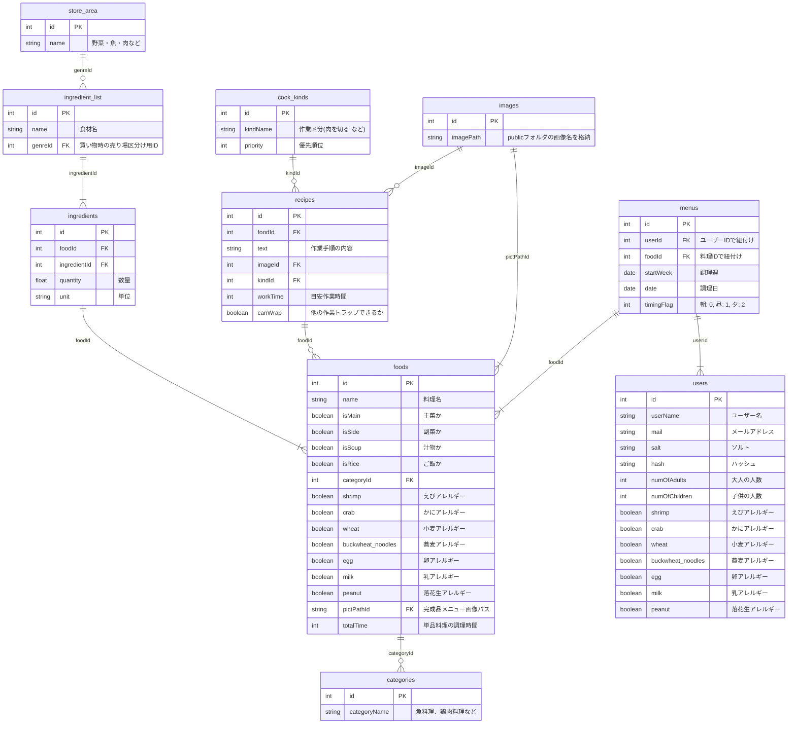

# AppName：🐻クックま🐻
あなたの日々の料理をサポートしてくれるアプリ

①献立自動生成

②買い物サポート

（5日分の献立の材料リストを表示。スーパーの売り場毎にグルーピングされており、入り口からレジに行くまでに効率よく買い物出来る）

③複数品献立作成時のマルチタスクで最も効率の良い料理手順を自動生成し、音声操作、音声読み上げで料理をサポート


# How to use 
アプリの動きは下記写真左→右の流れ

1.ログイン画面でユーザー名、パスワードを入力しログイン<br>

  　`ユーザー名:あなたの設定`<br>
   `passwword　:あなたの設定`
  
2.アカウントなければ新規登録で必要事項入力しログイン<br>

  　`ユーザー名　:あなたの設定`<br>
   `メールアドレス:あなたの設定`<br>
   `passwword　　:あなたの設定`<br>
   
  　`大人、子供の人数、アレルギーを登録する`
  
3.自動生成された献立(5日分)を確認

4.献立変更ボタンで献立を選択し、献立(5日分)を決める


5.買い物リストで献立(5日分)の食材を購入する

6.料理ボタンを押すと当日の献立の料理工程を最適化した手順で料理をサポート

　
　
　


# Index

- [About](#about)
- [Technology](#technology)
- [Setup](#setup)
- [ER diagram](#er-diagram)
- [Future plans](#future-plans)


# About
毎日忙しいけど愛する人を手料理で喜ばせたい...    
限られた時間で複数品の料理をマルチタスクで実施する為、自分の時間がなくゆっくり休めない。  
<br>
そんな方へ私達から解決手段を提供します。    
私たちのサービスを使用する事で、あなたとパートナーは、毎回新鮮で素晴らしい体験が出来るでしょう  


I am busy every day but want to please my loved ones with home-cooked food...    
You multitask and cook multiple dishes in a limited amount of time, leaving you no time for yourself and no time for rest. 
<br>
We offer you a solution.   
By using our service, you and your partner will have a fresh and wonderful experience every time!  


# Technology

### < frontend >
react-nativeのbare bareworkflow<br>
音声認識：react-native-voice<br>
音声読み上げ：Expo Speech

### < backend >
node.js、knex.js<br>
複数料理最適化自作ロジック<br>
自作レシピAPI<br>
認証：JWT(JSON Web Token)

### < Database >  
Postgresを使用

# Setup

### < Downloading and installing steps >  
iosシミュレータのみ動作確認済み<br>
事前にxcodeにて最新のシミュレータ動作環境を構築する<br>
`Xcode15.2`
`ios simulator 15.2`
`npm 9.8.1`

バックエンドはHerokuにデプロイ済み　2024/1/31まで稼働

1. efficient を clone する
```zh
git clone git@github.com:team2wish/efficient.git
```
2. clone したディレクトリ内に移動
```zh
cd efficient
```
3. vscode立ち上げる
```zh
code .
```
4. efficientルート直下でインストール
```zh
npm run setup
```

5. clientフォルダへ移動
```zh
cd client
```

6. アプリ起動
```zh
npm run ios
```


# ER diagram



# Future plans
- ユーザーレシピ投稿機能
- 料理工程最適化ロジックのブラッシュアップ
- リリース後の使用者の使用性フィードバック
