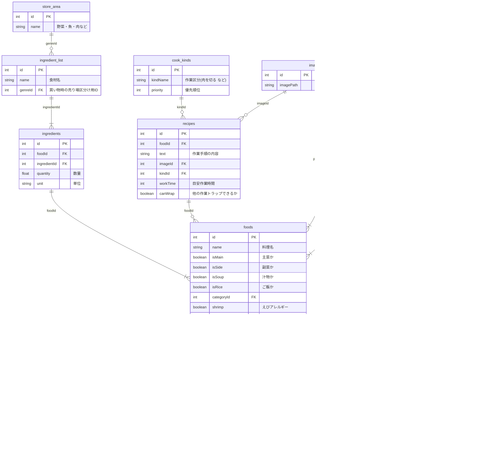

# こんにちは dev ブランチ

ルート直下で、`npm run setup`を起動すると、

- ルート直下
- client フォルダ内
- sever フォルダ内

で、

`npm install`コマンドが実行されて初期セットアップできます。

## ER 図

```mermaid
erDiagram
    foods ||--o{ categories : "categoryId"
    ingredients ||--|{ foods : "foodId"
    cook_kinds ||--o{ recipes : "kindId"
    recipes ||--o{ foods : "foodId"
    images ||--|{ foods : "pictPathId"
    ingredient_list ||--|{ ingredients : "ingredientId"
    menus ||--|{ foods : "foodId"
    images ||--o{ recipes : "imageId"
    menus ||--|{ users : "userId"
    store_area ||--o{ ingredient_list : "genreId"

    cook_kinds {
        int id PK
        string kindName "作業区分(肉を切る など)"
        int priority "優先順位"
    }


    recipes {
        int id PK
        int foodId FK
        string text "作業手順の内容"
        int imageId FK
        int kindId FK
        int workTime "目安作業時間"
        boolean canWrap "他の作業トラップできるか"
    }

    foods {
        int id PK
        string name "料理名"
        boolean isMain "主菜か"
        boolean isSide "副菜か"
        boolean isSoup "汁物か"
        boolean isRice "ご飯か"
        int categoryId FK
        boolean shrimp "えびアレルギー"
        boolean crab "かにアレルギー"
        boolean wheat "小麦アレルギー"
        boolean buckwheat_noodles "蕎麦アレルギー"
        boolean egg "卵アレルギー"
        boolean milk "乳アレルギー"
        boolean peanut "落花生アレルギー"
        string pictPathId FK "完成品メニュー画像パス"
        int totalTime "単品料理の調理時間"
    }

    ingredients {
        int id PK
        int foodId FK
        int ingredientId FK
        float quantity "数量"
        string unit "単位"
    }

    ingredient_list {
        int id PK
        string name "食材名"
        int genreId FK "買い物時の売り場区分け用ID"
    }

    store_area {
        int id PK
        string name "野菜・魚・肉など"
    }

    images {
      int id PK
      string imagePath "publicフォルダの画像名を格納"
    }

    categories {
        int id PK
        string categoryName "魚料理、鶏肉料理など"
    }

    users {
      int id PK
      string userName "ユーザー名"
      string mail "メールアドレス"
      string salt "ソルト"
      string hash "ハッシュ"
      int numOfAdults "大人の人数"
      int numOfChildren "子供の人数"
      boolean shrimp "えびアレルギー"
      boolean crab "かにアレルギー"
      boolean wheat "小麦アレルギー"
      boolean buckwheat_noodles "蕎麦アレルギー"
      boolean egg "卵アレルギー"
      boolean milk "乳アレルギー"
      boolean peanut "落花生アレルギー"
    }

    menus {
      int id PK
      int userId FK "ユーザーIDで紐付け"
      int foodId FK "料理IDで紐付け"
      date startWeek "調理週"
      date date "調理日"
      int timingFlag "朝: 0, 昼: 1, 夕: 2"
    }

```
